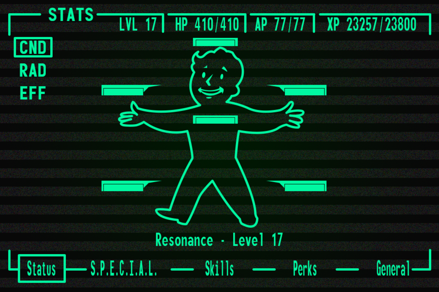
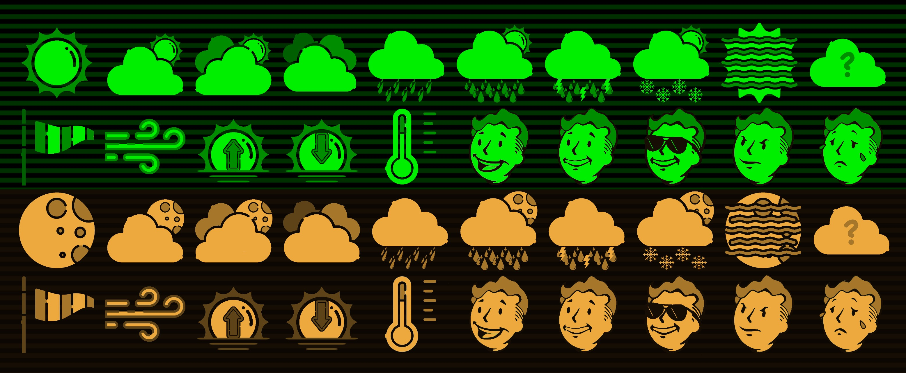
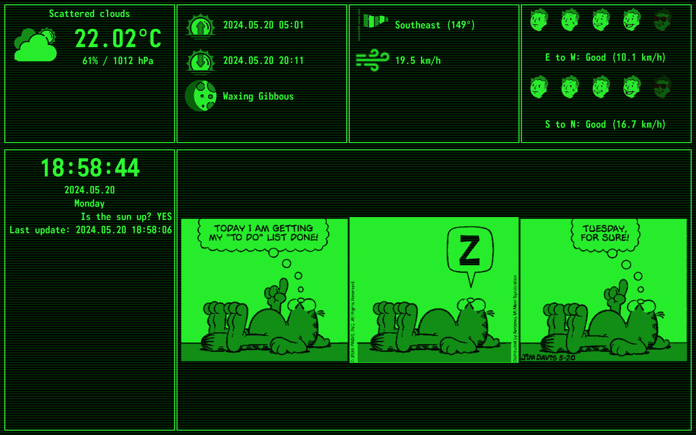
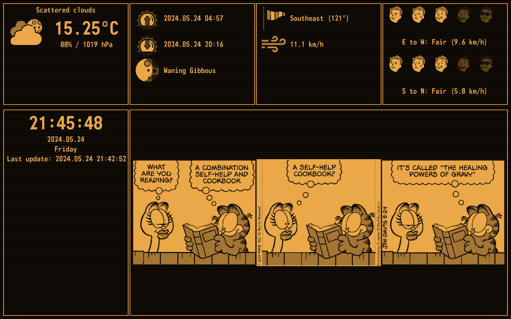
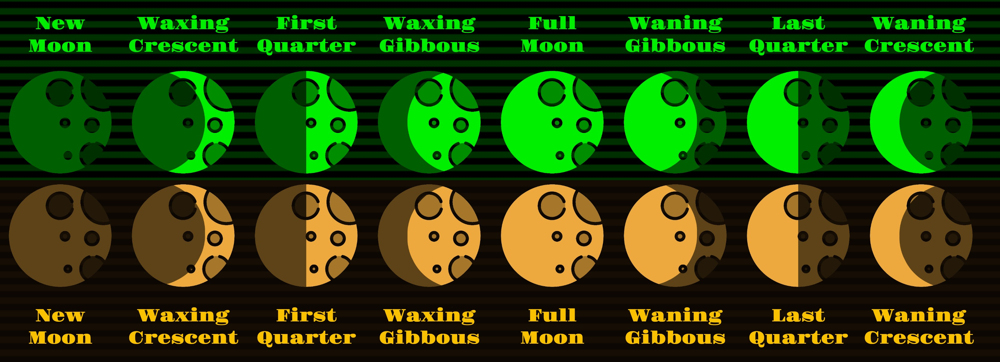

# Weather Station

## About the project
My final goal is to have a raspberrypi powered Pip-boy like dashboard app (from Fallout universe) developped in Python. Through this project I learn Kivy GUI for Python.

## Getting started
### Prerequisites
* **Python:** Version 3.10.0 and above
* **Kivy:** Version 2.3.0 and above
* **Tested on:** MacOs

### Configure and start the app
1. Download project
2. Rename `.env.template` to `.env`
3. Add your personal OpenWeatherAPI key to the `.env` file
4. Run `python3 main.py`

## Design
The design was insprired by the Pip-boy computer from Fallout game series  

First of all, using some base flat icons I created my own iconset for the app.  

Based on wether the sun is up on the sky or still below the horizont the app displays all the data in green or orange shades.

## Source of data
### Weather data
Both the actual and weather forecast data are provided by [OpenWeatherAPI](https://openweathermap.org/api/one-call-3)

### Moon phase
For moon phase calulation I used SubSystems' [Calculate the Moon Phase](https://www.subsystems.us/uploads/9/8/9/4/98948044/moonphase.pdf) description

### Comics
Comics are downloaded and recolorized from a radomly selected item of a predefined RSS source list.

## UI elements
### First row
- **Weather box:** main weather data box. Displays actual weather, temperature, hummidity and the weather forecast for the upcoming 3 days
- **Sun and Moon box:** one can track here the sunset and sunrise time of the actual day, plus is shows the actual state of the moon:
  
- **Wind box:** place for wind direction and wind speed data
- **Bike box:** I break down the wind speed into West to East (East to West) and North to South (South to North) components based on part of the day, then classify the speed of the components into a five value scale

### Second row
- **Date box:** clock and calendar data, plus there is still place for notifications
- **Fun box:** pull in the lates daily comic from a random RSS

## Contact
Peter Jenei - jenei.peter.dorozsma@gmail.com  
Project Link: https://github.com/jenei-peter-dorozsma/TerminalArcade